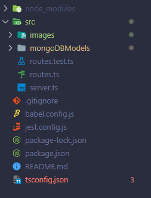
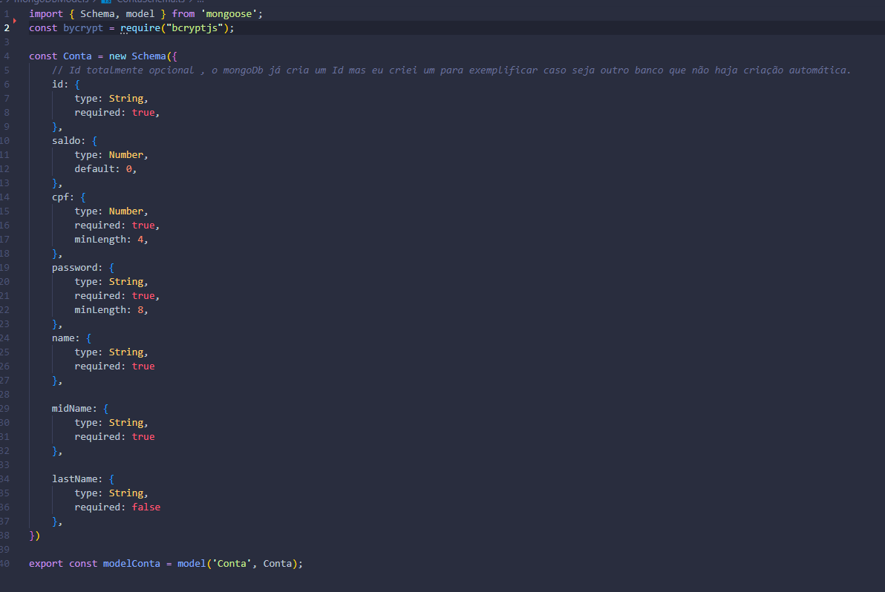

# Digital Republic Teste

<section>
  <h2>Contextualização</h2>
    
 Resolução do desafio proposto pela empresa Digital Republic em desenvolver um projeto Back-End. 

</section>

<section> 
  
 Eu acabei fazendo dois projetos utilizando formas diferentes para resolver o mesmo problema, este que é o primeiro projeto foi do jeito mais simples e rápido para a resposta do desafio, já a segunda parte foram utilizadas técnicas diferente.
    Acabei por optar em fazer dois projetos, pois neste primeiro foco inteiramente no MongoDb , já no segundo projeto penso em algo mais substituível em caso de alteração de banco de dados. 

</section>

<section>
  <h2>Tecnologias utilizadas</h2>
    <ul>
      <li>NodeJs > 14</li>
      <li>TypeScript</li>
      <li>MongoDb</li>
      <li>Jest</li>
      <li>Cors</li>
    </ul>
    
 A proposta do desafio não especificava um banco de dados, porém como já possuo conhecimento com MongoDB preferi optar por ele. 

    
 Para rodar o código primeiramente é necessário utilizar o comando "npm i" para instalar as dependências e em seguida utilizar o comando "npm run start".

    
 Caso queria rodar os testes de unidade basta utilizar o comando "npm run test", após a instalação das dependências.

    <h2>Bibliotecas utilizadas</h2>
    <ul>
      <li>Express (Criação das rotas)</li>
      <li>uuidv4 (Criação dos Id's)</li>
      <li>Bcrypt (Criação de senhas com hash)</li>
      <li>Mongoose (Manipulação de querys , modelos , schemas, etc, do MongoDB)</li>
    </ul>
    
 Foi utilizado o Visual Studio Code para o desenvolvimento de todo o código. 

    
 Foram feitos dois projetos utilizando das mesmas bibliotecas , vou separar cada um e explicar o porque de dois projetos diferente. 

</section>

<section>
  <h2> Primeiro Projeto (Padrão) </h2>
  <h3> Organização das pastas </h3>
  
  
 Como podemos ver na imagem acima , possuímos a pasta src e dentro dela temos 1 pasta importante, a "mongoDBModels", e também possuímos os arquivos routes.ts e    server.ts.

  <h2> Pasta mongoDBModels </h2>
  <section>
    
Dentro da pasta mongoDBModels nós temos um arquivo com o Schema(Modelo) da classe Conta, o que será nossa conta bancária e seus atributos como mostrado na imagem abaixo

    
     
 Na criação dos atributos do Schema nós possuímos algumas keywords que são: 

    <ul>
      <li> required - dado obrigatório ao construir o objeto </li>
      <li> type - tipo do dado (number, string, etc) </li>
    </ul>
    
Dentro deste modelo nós temos os atributos que são: 

    <ul>
      <li>id</li>
      <li>saldo</li>
      <li>cof</li>
      <li>password</li>
      <li>name</li>
      <li>midName</li>
      <li>lastName</li>
    </ul>
  </section>
  
  <h2> Arquivo routes.test.ts </h2>
  
Neste arquivo se encontram os testes de unidade (fiz todos baseados em funcionar o teste , caso queira que de falha é só inserir alguma informação no .send de cada teste).

  
  <h2> Arquivo routes.ts </h2>
  <section>
    
 No arquivo routes.ts nós possuímos os endpoits do projeto, e eles são: 

    
 Métodos Get 

    <ul> 
      <li> getConta </li>
      <li> getSaldo </li>
    </ul>
    
 Métodos Post 

    <ul> 
      <li> criarConta </li>
      <li> login </li>
    </ul>
    
 Métodos Put 

    <ul> 
      <li> depositar </li>
      <li> transferencia </li>
    </ul>
  </section>
  
  <h2> Arquivo server.ts </h2>
  <section> 
    
 Por fim nós temos o arquivo server.ts onde fica a configuração e inicialização da API

  </section>

  <h2> Segundo Projeto </h2>
  https://github.com/victormdsp/DigitalRepublic2
